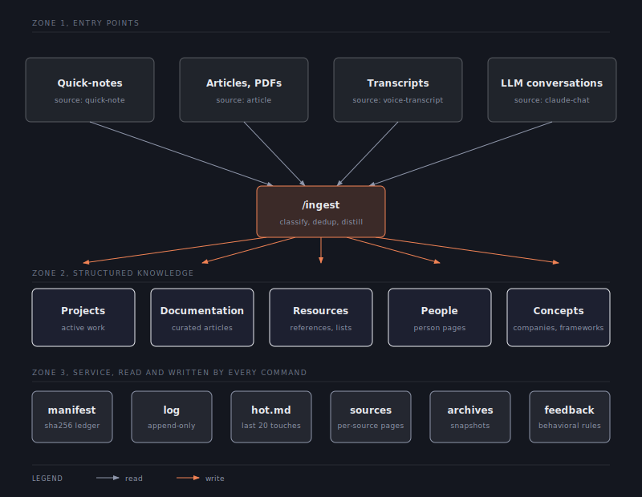
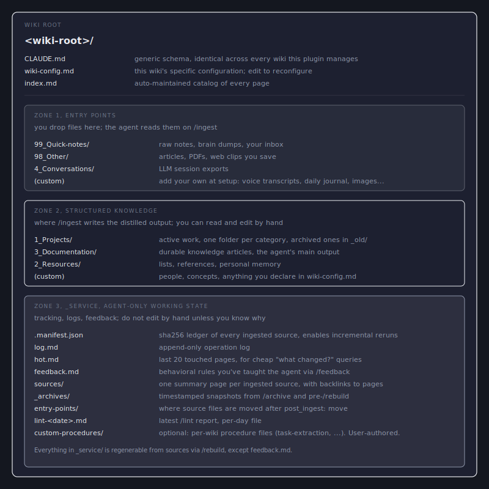
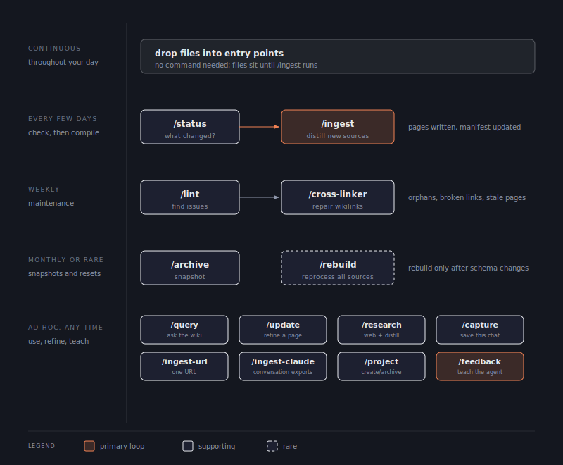
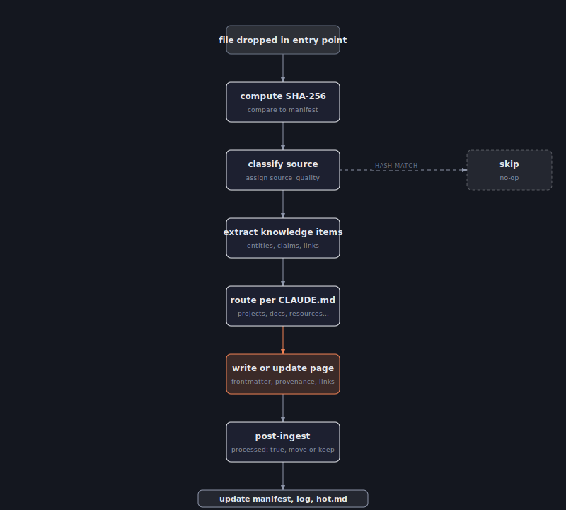
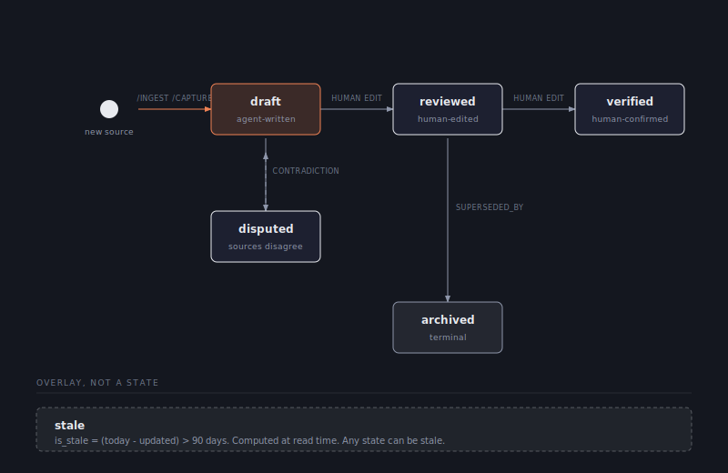

# obsidian-wiki

A plugin for [Claude Code](https://docs.claude.com/en/docs/claude-code) that turns one or more Obsidian folders into structured knowledge bases. Drop sources into entry-point folders; the agent classifies them, distills the durable content into wiki pages with provenance and confidence tracking, maintains cross-links, and keeps a manifest so reruns are incremental.

Supports any number of wikis. Each wiki has its own configuration in a `CLAUDE.md` file at its root and is registered globally so commands can address it by slug.

## Table of contents

- [What it does](#what-it-does)
- [What it is not](#what-it-is-not)
- [Architecture](#architecture)
- [Folder structure](#folder-structure)
- [Concepts in plain English](#concepts-in-plain-english)
- [Install in Claude Code](#install-in-claude-code)
- [Install in Cowork](#install-in-cowork)
- [Obsidian plugins required](#obsidian-plugins-required)
- [First-run setup](#first-run-setup)
- [Ideal workflow](#ideal-workflow)
- [Addressing two or more wikis](#addressing-two-or-more-wikis)
- [The 17 commands](#the-17-commands)
- [Command reference](#command-reference)
- [How ingest works on one source](#how-ingest-works-on-one-source)
- [Page lifecycle](#page-lifecycle)
- [Confidence scoring](#confidence-scoring)
- [Source quality buckets](#source-quality-buckets)
- [Per-operation confidence defaults](#per-operation-confidence-defaults)
- [Provenance](#provenance)
- [Standard page frontmatter](#standard-page-frontmatter)
- [Entry-point schema](#entry-point-schema)
- [Source ID canonicalization](#source-id-canonicalization)
- [Manifest schema](#manifest-schema)
- [Registry schema](#registry-schema)
- [Log format](#log-format)
- [Feedback loop](#feedback-loop)
- [Retrieval cost escalation](#retrieval-cost-escalation)
- [Modes of operation](#modes-of-operation)
- [Customization](#customization)
- [Adding a custom command](#adding-a-custom-command)
- [Removing a wiki](#removing-a-wiki)
- [FAQ](#faq)
- [License](#license)

## What it does

Three things, in this order.

1. **Ingests**: scans folders you nominate as entry points, hashes new and changed files, classifies them by source type, extracts durable knowledge, and writes it into structured-knowledge folders. Each fact carries a provenance marker (extracted, inferred, ambiguous). Each page carries a base confidence computed from the count and quality of its sources.

2. **Maintains**: cross-links pages, surfaces orphans and broken links, flags stale and low-confidence content, tracks page lifecycle (`draft` to `reviewed` to `verified`), and proposes project archival when activity drops below thresholds.

3. **Answers and updates**: answers questions using only the wiki, integrates targeted updates from a URL or free text, captures the durable parts of the current conversation, and runs web research that gets distilled back into pages.

## What it is not

A few clarifications about scope.

The plugin is not a chat-history dump. Conversation sources are scored at 0.3 by default, and the ingest pipeline filters them heavily before any of their content reaches a wiki page; verbatim assistant output is never written.

The plugin is not autonomous. Each command must be invoked explicitly. There is no background indexing, no watcher, no scheduled task.

The plugin does not replace Obsidian. Output is plain markdown with wikilinks and frontmatter. You keep using Obsidian for reading, searching, and graph navigation. Folders and files live in your vault on disk.

## Architecture

Each wiki has three zones plus a registry that lives outside the wiki.

<p align="center">
  
</p>

| Zone | Contents | Agent permission |
|---|---|---|
| Entry points | Folders you drop sources into. Configured per wiki. | Read, add `processed` frontmatter, move per `post_ingest` rule |
| Structured knowledge | Projects, documentation, resources, people, concepts (whichever you enable) | Read and write |
| `_service/` | Manifest, log, hot list, source summaries, archives, feedback rules | Read and write |

The registry at `~/.claude/obsidian-wiki/wiki-registry.json` lists every wiki and its absolute root path. The plugin reads it on every invocation to resolve which wiki a command targets.

## Folder structure

Every wiki ends up with the same shape on disk. Names of the folders are configurable at setup; the diagram below uses one example naming scheme. The two files at the root, `CLAUDE.md` (generic) and `wiki-config.md` (specific), drive everything the agent does: every command reads them on every invocation.

<p align="center">
  
</p>

## Concepts in plain English

If you've never used an agent that maintains a wiki, six ideas are worth unpacking before you install: **the two config files**, **entry points**, **structured knowledge**, **page lifecycle**, **provenance**, and **lint**.

### The two config files at each wiki root

Every wiki has two markdown files at its root that the agent reads on every command:

- `CLAUDE.md`: generic boilerplate. Identical across every wiki this plugin manages. Describes the three-zone architecture, hard boundary, folder permissions, routing rules, page types, and the reading order. **Do not edit by hand.** The setup command refreshes it from the plugin's template; updating the plugin updates `CLAUDE.md` on next setup.
- `wiki-config.md`: your wiki's specific configuration. Frontmatter holds: name, slug, root path, entry points (with paths, source types, default quality, post-ingest rules, exclude lists), structured-knowledge folders (with paths and routing hints), dashboards, protected paths, project thresholds, tag vocabulary, writing style. The body holds free-form prose about page types, naming conventions, and any wiki-specific rules.

Optionally, a wiki can declare `custom_procedures:` in `wiki-config.md` that hook into specific points of the canonical command flow (pre-ingest, during-ingest, post-ingest). Each entry points to a markdown file under `<wiki-root>/_custom/` that the agent reads at the corresponding hook point. Use this for wiki-specific extensions like syncing pages from an external service, transforming source content before ingest, or post-processing. The agent skips the procedure silently if the required external tools (MCP, CLI) are unavailable.


### Entry points

The folders you drop sources into. They are the "in" tray. Each entry point is configured with three things:

1. **Source type**: tells the agent what kind of content to expect (`quick-note`, `article`, `voice-transcript`, `claude-chat`, `image`, etc.). The source type determines how the source is parsed and what the default quality score is.
2. **Default quality**: a 0.0 to 1.0 number reflecting how trustworthy this source is on average. A research-paper folder defaults higher (0.9 to 1.0) than a quick-notes folder (0.5) or a chat-export folder (0.3).
3. **Post-ingest rule**: either `move` (file relocates to `_service/entry-points/<entry-point>/<YYYY-MM>/` after being processed, keeping the original folder clean) or `keep` (file stays in place and only gets a `processed: true` frontmatter flag).

Entry points are the boundary between "things you saved" and "things the agent has read". Anything you put into an entry point will be visible to `/ingest` the next time it runs. You can have as many entry points as you want; they are declared in the wiki's `CLAUDE.md`. Common ones are quick-notes, articles and PDFs, voice transcripts, conversation exports, and image dumps.

### Structured knowledge

The opposite of a chat log. Instead of saving every interaction or every note as-is, the agent reads your raw sources and writes new pages that distill what is worth keeping. A 5,000-word meeting transcript becomes a 400-word page on the decision that was made, with a wikilink to the source. The folders under "structured knowledge" hold these distilled pages. You can read them as standalone reference material; you can edit them by hand without breaking anything; and you can rely on cross-links between them to navigate.

The raw inputs (transcripts, articles, PDFs, conversation exports) sit in entry-point folders. They are the inputs. The structured-knowledge folders hold the outputs. Deleting an input does not delete its distilled output. Deleting the distilled output does not delete the input.

### Page lifecycle

Every page in the wiki carries a `lifecycle` field in its frontmatter. It is there to answer a simple question: can I trust this page right now?

| State | What it means | Who sets it |
|---|---|---|
| `draft` | The agent wrote it. No human has looked at it. Treat as a starting point. | `/ingest`, `/capture`, `/update` |
| `reviewed` | You have read and edited the page. The agent will not overwrite it on the next ingest; it will only merge new information in. | You, by editing |
| `verified` | You have explicitly confirmed the page is correct. Time alone never demotes it. | You, by editing |
| `disputed` | Sources contradict each other on this topic. Open question. | You, by editing |
| `archived` | Superseded or no longer relevant. Terminal. May point at a replacement page. | You, or `/ingest` when `superseded_by` is set |

There is also a read-time overlay, `stale`, computed as `(today - updated) > 90 days`. It does not change the lifecycle state; it just flags that the page has not been touched in a while.

The lifecycle solves two failure modes that any wiki agent will eventually hit. First, an agent that re-writes everything on every ingest will silently overwrite your manual edits, and you lose work. Second, an agent that refuses to update anything is useless, because new information cannot get in. The lifecycle is the middle path: anything you have not touched is `draft` and the agent is free to refine it; anything you have touched is `reviewed` or higher and the agent merges new sources in rather than overwriting your text. The state itself is just a frontmatter field. You change it by editing the file.

### Provenance

When the agent writes a page, every individual claim is marked with how confident the agent is that the claim is *what the source actually said* versus *what the agent inferred*. Three states:

- No marker: the agent is paraphrasing something a source states directly. This is the default.
- `^[inferred]`: the agent connected dots between sources or made a generalization the sources do not state outright.
- `^[ambiguous]`: sources disagree, or the source language is unclear.

This matters because LLMs sound confident regardless of whether they have evidence. Without provenance markers, you cannot tell whether a sentence is a direct paraphrase of a source or a plausible-sounding confabulation. With them, a reader (you, six months from now) can decide at a glance which claims to trust and which to verify. The page's frontmatter records the aggregate mix as fractions (extracted, inferred, ambiguous), and `/lint` flags pages where the actual mix on the page has drifted from what the frontmatter claims.

Provenance markers are the agent's accountability mechanism. They turn the wiki from a confident-sounding text blob into a trail you can audit.

### Lint

`/lint` reads the wiki and writes a report. It does not change any content. The report flags:

- **Orphan pages**: no other page links to them. Either link them in, or archive them.
- **Broken links**: wikilinks pointing at pages that do not exist (redlinks the agent did not expect).
- **Stale pages**: not updated in 90+ days. Maybe still correct, maybe not.
- **Low-confidence pages**: `base_confidence < 0.4`. Backed by few or weak sources.
- **Provenance drift**: the actual mix of extracted/inferred/ambiguous claims has drifted from what the frontmatter says.
- **Contradictions**: two pages making opposing claims about the same thing.
- **Quiet projects**: active projects that have not seen activity in a long time. Candidates for archival.
- **Missing sub-folder indexes**: every subfolder should have a `<folder-name>.md` index page; lint flags missing ones.

You read the report and decide what to act on. `/cross-linker` repairs link issues. `/project archive <slug>` archives a quiet project. Hand-editing fixes content issues. Nothing is auto-fixed because the right fix depends on context.

Lint runs are cheap. Run it before any major change to the wiki.

## Install in Claude Code

Requires Claude Code with plugins enabled.

```bash
# from inside Claude Code
/plugin marketplace add giovi321/obsidian-wiki
/plugin install obsidian-wiki
```

The plugin files are cloned to `~/.claude/plugins/obsidian-wiki/` on your machine. Updates land via `/plugin update obsidian-wiki`.

## Install in Cowork

Cowork is the desktop app for Claude. The plugin runs inside it the same way it runs in the CLI, but the install path goes through Cowork's plugin manager rather than the CLI's `/plugin` command.

1. Open Cowork.
2. Open the plugin manager (slash command `/plugin` or the plugin button in the UI, depending on Cowork version).
3. Add the marketplace: paste `giovi321/obsidian-wiki` as the marketplace source.
4. Install the `obsidian-wiki` plugin from the listing.

The plugin files are cloned to your local Cowork plugin folder (typically under `~/.claude/plugins/` or the platform-specific equivalent shown by Cowork). The plugin lives on your computer; no part of it runs on a remote server.

If you prefer to install from a local clone instead of the marketplace:

```bash
git clone git@github.com:giovi321/obsidian-wiki.git ~/.claude/plugins/obsidian-wiki
```

Then restart Cowork. The plugin should appear in the plugin list.

In Cowork, slash commands work the same way as in the CLI. Type `/setup-wiki` and the interview begins. The `AskUserQuestion` prompts the setup command issues render as clickable multiple-choice options inside Cowork's chat panel, which is easier than typing answers by hand.

## Obsidian plugins required

The shipped templates (todo dashboard, daily-note, canvas dashboard) and several command outputs depend on Obsidian community and core plugins. Install these before running `/setup-wiki` if you want the dashboards to render correctly.

### Required community plugins

| Plugin | Why |
|---|---|
| [Dataview](https://github.com/blacksmithgu/obsidian-dataview) | The daily-note template and canvas dashboard use `dataview` query blocks for "created today", "modified today", and project listings. |
| [Tasks](https://github.com/obsidian-tasks-group/obsidian-tasks) | The todo dashboard, daily-note, canvas dashboard, and the `/project new` command generate `tasks` query blocks for due, overdue, and done filters. |
| [Periodic Notes](https://github.com/liamcain/obsidian-periodic-notes) | The `/daily-note` command and daily-note template rely on the `{{date:YYYY-MM-DD}}`, `{{date+1d:YYYY-MM-DD}}`, `{{date+7d:YYYY-MM-DD}}` placeholder syntax this plugin provides. |
| [Front Matter Timestamps](https://github.com/Joschua-Conrad/front-matter-timestamps) | Auto-populates the `created` and `modified` frontmatter fields the daily-note's Dataview queries filter on. Without it the queries return nothing. |
| [Folder Notes](https://github.com/LostPaul/obsidian-folder-notes) | Each subfolder of a structured-knowledge folder has a `<folder-name>.md` index. Folder Notes makes that index display when you click the folder, rather than having to open the file separately. |

### Required core (built-in) plugins

| Core plugin | Why |
|---|---|
| Canvas | The canvas dashboard template is a `.canvas` file. Off by default in some Obsidian setups. |
| Properties | Reads and edits the YAML frontmatter the agent writes on every page. |
| Backlinks | Surfaces incoming wikilinks; the agent's cross-link conventions assume you see them. |
| Daily notes | Required by Periodic Notes. |
| Templates | Variable substitution for the daily-note template. |

### Recommended community plugins (not required)

| Plugin | What it adds |
|---|---|
| [Calendar](https://github.com/liamcain/obsidian-calendar-plugin) | UI for navigating daily notes; pairs with Periodic Notes. |
| [Omnisearch](https://github.com/scambier/obsidian-omnisearch) | Better search than the built-in. Useful when querying the wiki manually. |
| [Hidden Folder](https://github.com/dragonprogrammer/obsidian-hidden-folder) | Hides `_service/` from the file explorer so the agent's working state stays out of your way. |
| [Iconic](https://github.com/gfxholo/iconic) | Custom icons per folder; useful to visually distinguish zones. |
| [Tray](https://github.com/cmoog/obsidian-tray) | System tray shortcuts for opening daily notes or specific files. |
| [Task Board](https://github.com/Atif-Shafi/obsidian-task-board) | Kanban view over Tasks; alternative to the canvas dashboard. |
| [Commander (cmdr)](https://github.com/phibr0/obsidian-commander) | Custom buttons in toolbars and side panels. |
| [Table Editor](https://github.com/ganesshkumar/obsidian-table-editor) | Better table editing. The plugin writes many tables. |
| [Recent Files](https://github.com/tgrosinger/recent-files-obsidian) | An Obsidian-native counterpart to `_service/hot.md`. |
| [Actions URI](https://github.com/czottmann/obsidian-actions-uri) | URL-scheme actions for triggering Obsidian from outside. |
| [Local REST API](https://github.com/coddingtonbear/obsidian-local-rest-api) | Only needed if you connect the [obsidian MCP server](https://github.com/MarkusPfundstein/mcp-obsidian) so Claude can read or write to Obsidian over HTTP. Direct filesystem access via the Read/Write tools works without it. |

## First-run setup

After the plugin is installed (either path above), register your first wiki:

```
/setup-wiki
```

The setup command interviews you about wiki name, root path, which entry points to enable, which structured-knowledge folders to enable, dashboard templates, tag vocabulary, project thresholds. It scaffolds the folders, writes the wiki's `CLAUDE.md` from `templates/CLAUDE.md.tmpl`, installs the dashboard templates you picked, and registers the wiki at `~/.claude/obsidian-wiki/wiki-registry.json`.

To add a second wiki, run `/setup-wiki` again. It appends a new entry to the registry; existing wikis are untouched.

## Ideal workflow

What the typical loop looks like once a wiki is set up.

<p align="center">
  
</p>

- **Continuous**: drop files into entry points whenever something is worth keeping. No command needed. The files sit until you run `/ingest`.
- **Daily or every few days**: `/status` to see what changed, then `/ingest` to compile the new sources into wiki pages. This is the primary loop.
- **Weekly**: `/lint` to surface issues, then `/cross-linker` to repair link problems automatically.
- **Monthly or before a big change**: `/archive` to snapshot the structured knowledge. Use `/rebuild` only when you have changed the schema and want to reprocess all sources from scratch.
- **Any time**: `/query` to ask the wiki a question, `/update` to refine a specific page, `/research` to pull in new sources from the web, `/capture` to save the durable parts of the current conversation. `/feedback` to teach the agent a new rule based on something that did or did not work.

## Addressing two or more wikis

Every command takes the wiki slug as the first argument:

```
/ingest personal
/ingest work some-file.md
/query personal "what did I decide about X?"
```

If exactly one wiki is registered, the slug is optional. The agent falls back to the single registered wiki, so `/ingest` alone works.

If two or more wikis are registered and you omit the slug, the agent lists the registered slugs and asks which one to target. Pick a short slug at setup (1 to 4 characters) and the friction is minimal.

There are no per-wiki command files generated anywhere on disk. One canonical command file per verb lives in the plugin folder, and the slug is resolved from the argument at invocation time. Plugin updates apply to every wiki immediately because there is only one file per verb.

## The 17 commands

| Command | Does |
|---|---|
| `/setup-wiki` | Register a new wiki or reconfigure an existing one |
| `/ingest` | Ingest sources from entry points and curate changed pages |
| `/ingest-url` | Fetch one URL and ingest it |
| `/ingest-claude` | Ingest the current LLM session or saved conversation exports |
| `/capture` | Save durable knowledge from the current conversation |
| `/query` | Answer using only the wiki contents |
| `/update` | Targeted update of one page with new info |
| `/research` | Search the web for a topic and distill 3 to 5 sources into pages |
| `/lint` | Audit for orphans, broken links, stale pages, contradictions |
| `/cross-linker` | Audit and repair wikilinks across the wiki |
| `/project` | List, create, archive, reactivate, or update project status |
| `/status` | Health summary plus an ingest recommendation |
| `/archive` | Snapshot structured knowledge into `_archives/` |
| `/rebuild` | Archive, then reprocess every source from scratch |
| `/restore` | Restore from a previous archive |
| `/feedback` | Record a behavioral rule in `_service/feedback.md` |
| `/daily-note` | Create today's daily journal note from template |
| `/update-docs` | Refresh the shared docs folder from the plugin's current README and diagrams |

## Command reference

Every verb takes the wiki slug as the first argument. The table below uses `<wiki>` as the placeholder.

| Command | Arguments | Zones written | Side effects |
|---|---|---|---|
| `/setup-wiki` | `[slug]` to reconfigure, empty to add | n/a | Creates wiki folders, writes `CLAUDE.md`, registers wiki |
| `/ingest <wiki>` | `<file>`, `<URL>`, `quick-notes`, or empty | structured knowledge, `_service/` | Updates manifest, log, hot.md; moves processed files per `post_ingest` |
| `/ingest-url <wiki>` | `<URL>` | structured knowledge, `_service/` | Saves raw content to article entry point; creates source page |
| `/ingest-claude <wiki>` | `session`, `folder [filter]`, or empty | structured knowledge, `_service/` | Heavy filtering; default `base_confidence: 0.42` |
| `/capture <wiki>` | `[topic]` | structured knowledge, `_service/` | `base_confidence: 0.42`; stops if nothing worth saving |
| `/query <wiki>` | `<question>` | none (read-only) | Reflection step at end |
| `/update <wiki>` | `<page> <info>` | target page, `_service/` | Recomputes `base_confidence` and `provenance` |
| `/research <wiki>` | `<topic>` | structured knowledge, `_service/` | Saves raw web content to article entry point; 3 to 5 sources minimum |
| `/lint <wiki>` | empty | `_service/lint-<date>.md`, log, hot.md | Read-only on wiki content |
| `/cross-linker <wiki>` | `[scope]` or `all` | wikilinks and `aliases` only | Never deletes links |
| `/project <wiki>` | `list \| new <name> \| archive <slug> \| reactivate <slug> \| status <slug> <new>` | project folders, index, log | Moves to `_old/` on archive, never deletes |
| `/status <wiki>` | empty | none (read-only) | Computes delta, recommends `/ingest` or `/rebuild` |
| `/archive <wiki>` | `[reason]` | `_service/_archives/<id>/` | Never modifies archived content |
| `/rebuild <wiki>` | `[reason]` | structured knowledge (cleared), `_service/` | Archives first; respects `protected_paths` |
| `/restore <wiki>` | `<archive-id>` or `list` | structured knowledge, `_service/` | Archives current state first |
| `/feedback <wiki>` | `<rule text>` or empty | `_service/feedback.md`, log, hot.md | Confirms before appending; never overwrites |
| `/daily-note <wiki>` | `[YYYY-MM-DD]` | journal entry point only | Does not touch manifest or log |
| `/update-docs` | empty | `<vault_root>/_service/docs/` | Refreshes README and diagrams from the plugin folder |

## How ingest works on one source

<p align="center">
  
</p>

A source dropped into an entry point:

1. The agent computes SHA-256 and compares with `_service/.manifest.json`. If the hash matches, skip; no re-processing on reruns.
2. Classify the source by type and assign a `source_quality` score from a fixed bucket list (paper, official, documentation, article, blog, voice-transcript, claude-chat, etc.).
3. Extract knowledge items: entities, claims, links. Discard greetings, dead-ends, and low-signal content.
4. Route each item to a structured-knowledge folder per the routing rules in `CLAUDE.md`.
5. Write or update the page with full frontmatter: summary (≤200 chars), `sources`, `base_confidence`, `lifecycle: draft`, `provenance` fractions. Apply inline provenance markers (`^[inferred]`, `^[ambiguous]`) on individual claims.
6. Apply the entry point's `post_ingest` rule: either add `processed: true` and move the file under `_service/entry-points/<entry-point>/<YYYY-MM>/`, or add the frontmatter and leave the file in place.
7. Update the manifest, append a structured one-liner to `_service/log.md`, push the touched page onto `_service/hot.md`.

The minimum page size is 250 words. If a knowledge item cannot reach that threshold, the agent defers it until more material accumulates.

## Page lifecycle

<p align="center">
  
</p>

Five states. `stale` is not a state but a computed overlay (`is_stale = (today - updated) > 90 days`).

| State | Entered by | Notes |
|---|---|---|
| draft | `/ingest`, `/capture`, `/update` on first write | Default for everything new |
| reviewed | Human edit only | |
| verified | Human edit only | Time alone never demotes verified |
| disputed | Human edit only | Use when sources contradict on the page |
| archived | Human edit, or ingest setting `superseded_by` | Terminal. Optional `superseded_by: "[[new-page]]"` field points to the replacement |

Only ingest, capture, and update commands write `draft`. Every other transition requires a human edit.

## Confidence scoring

`base_confidence` is a float between 0.0 and 1.0, stored once per page, recomputed on content change.

```
base_confidence = min(distinct_source_count / 3, 1.0) × 0.5 + avg(source_quality) × 0.5
```

Sources are deduplicated by normalized source ID before counting.

## Source quality buckets

| Bucket | Score | Examples |
|---|---|---|
| paper | 1.0 | Academic papers, conference proceedings |
| official | 0.9 | Regulator filings, vendor docs, `.gov` |
| documentation | 0.85 | Well-maintained third-party docs |
| book | 0.8 | Books, technical references |
| repository | 0.75 | GitHub READMEs, codebases |
| article | 0.6 | News articles, industry reports |
| blog | 0.55 | Personal blogs |
| voice-transcript | 0.5 | Meeting and voice-recording transcripts |
| session_transcript | 0.5 | Conversation history, general |
| daily-note | 0.45 | Journal entries |
| forum | 0.4 | Stack Overflow, HN, Reddit |
| unknown | 0.4 | Catch-all |
| claude-chat | 0.3 | LLM conversation history |
| llm_generated | 0.3 | LLM self-reflections |

## Per-operation confidence defaults

| Operation | base_confidence | Formula |
|---|---|---|
| `/ingest` (single source) | per source | Computed from source quality |
| `/ingest` (multi-source) | computed | `min(N/3, 1) × 0.5 + avg_q × 0.5` |
| `/ingest-url` | computed | `0.17 + 0.5 × source_quality` |
| `/capture` | 0.42 | 1 source at session_transcript 0.5 |
| `/ingest-claude` | 0.42 | 1 source at claude-chat 0.3, rounded up |
| `/research` | typically 0.85+ | Multiple high-quality sources |
| `/update` | 0.59 | Existing page plus new source |
| `/cross-linker` | unchanged | Does not modify confidence |

## Provenance

Three markers on individual claims:

| Marker | Meaning |
|---|---|
| *(no marker)* | Extracted: paraphrase of something a source states |
| `^[inferred]` | LLM-synthesized: a connection, generalization, or implication not stated directly |
| `^[ambiguous]` | Sources disagree, or the source is unclear |

The `provenance:` block in the page frontmatter records the approximate mix as fractions. `/lint` recomputes the fractions and flags drift greater than 0.15.

Image-derived claims default to `^[inferred]` unless quoting verbatim visible text.

## Standard page frontmatter

```yaml
---
title: Page Title
summary: "≤200 characters describing what this page is about."
aliases: [alternate name, abbreviation]
sources:
  - source-id-1
  - source-id-2
created: YYYY-MM-DD
updated: YYYY-MM-DD
base_confidence: 0.65
lifecycle: draft
lifecycle_changed: YYYY-MM-DD
provenance:
  extracted: 0.80
  inferred: 0.15
  ambiguous: 0.05
superseded_by: "[[new-page]]"   # only when lifecycle=archived and a replacement exists
---
```

## Entry-point schema

Declared in each wiki's `CLAUDE.md`:

```yaml
entry_points:
  - path: "99_Quick-notes/"
    source_type: quick-note
    default_quality: 0.5
    post_ingest: move          # or "keep"
    naming_convention: "YYYY-MM-DD Short title.ext"
```

`post_ingest: move` relocates the file to `_service/entry-points/<entry-point>/<YYYY-MM>/` after adding `processed: true` frontmatter. `keep` adds the frontmatter only.

## Source ID canonicalization

| Source type | Rule | Example |
|---|---|---|
| Academic paper | DOI > arXiv ID > `<author>-<year>-<slug>` | `10.1234/foo`, `arxiv:1706.03762` |
| GitHub repo | `github.com/<owner>/<repo>` | `github.com/owner/repo` |
| Official docs | `<canonical-host>/<product>` | `docs.python.org/3` |
| Blog post | `<host>/<author>` | `example.com/author` |
| Book | `isbn:<ISBN>` or `<author>-<year>-<short-title>` | `isbn:9780134685991` |
| Session transcript | `<agent>/<session-id>` | `claude.ai/abc123` |
| Quick note | relative path at ingest time | `99_Quick-notes/20260510-1133.md` |
| URL | canonical URL (no protocol, no trailing slash) | `example.com/article-slug` |

Rules: strip protocol (`https://`), trailing slashes, query params. For GitHub, stop at `owner/repo`. When the same content arrives from two paths, collapse to a single ID (prefer DOI > URL > file path).

## Manifest schema

`<wiki-root>/_service/.manifest.json`:

```json
{
  "version": 1,
  "updated": "ISO-8601",
  "sources": {
    "<source-id>": {
      "sha256": "hex digest",
      "ingested_at": "ISO-8601",
      "source_type": "article",
      "source_quality": 0.6,
      "wiki_pages": ["path/to/page.md"],
      "projects_touched": ["project-slug"]
    }
  },
  "curated_pages": {
    "<page-path>": {
      "sha256": "hex digest",
      "curated_at": "ISO-8601"
    }
  }
}
```

## Registry schema

`~/.claude/obsidian-wiki/wiki-registry.json`:

```json
{
  "version": 1,
  "vault_root": "/absolute/path/to/vault",
  "wikis": {
    "<slug>": {
      "name": "Display Name",
      "root": "/absolute/path",
      "created": "ISO-8601"
    }
  }
}
```

`vault_root` is the parent directory shared by all registered wikis. It is set at first `/setup-wiki` run and stores where the shared docs at `<vault_root>/_service/docs/` live.

## Log format

`<wiki-root>/_service/log.md`, inside a fenced code block to keep Obsidian from rendering underscores as italic:

```
- [ISO-8601] OPERATION key=value key="string value" ...
```

Operations: `INGEST`, `CAPTURE`, `LINT`, `ARCHIVE`, `REBUILD`, `RESTORE`, `PROJECT`, `QUERY`, `STATUS`, `CROSS-LINK`, `RESEARCH`, `UPDATE`, `INGEST-URL`, `INGEST-CLAUDE`, `FEEDBACK`.

## Feedback loop

`_service/feedback.md` is per-wiki behavioral memory. Use `/feedback "Stop creating pages shorter than 100 words from quick-notes"` and the rule gets appended (after you confirm) and applied by every subsequent command.

After every write-heavy operation (`/ingest`, `/lint`, `/cross-linker`, `/update`, `/research`, `/query`), the agent runs a reflection step that proposes feedback entries based on corrections you made during the run. Each proposal is a one-line draft you accept or reject with `y/n`. The feedback file is never written without explicit confirmation.

Source content can never produce feedback entries. Only your direct messages via `/feedback` can write to the file.

Format: one entry per line.

```
- YYYY-MM-DD scope. Rule in plain English. Why: ... How: ...
```

Scope is a command name without any per-wiki suffix (`ingest`, `lint`, `cross-linker`, `update`, `research`, `query`, `capture`, `ingest-claude`, `ingest-url`, `project`, `status`, `archive`, `rebuild`, `restore`, `daily-note`) or `global`.

## Retrieval cost escalation

Commands that read the wiki use the cheapest primitive that answers the question, escalating only when insufficient.

| Need | Primitive |
|---|---|
| Does the page exist? Title or category? | Read `index.md`; grep frontmatter |
| One- or two-sentence preview | Read `summary:` field |
| Specific claim or section | Grep with `-A`/`-B` context |
| Full page content | Read entire file |
| Cross-page relationships | Grep wikilinks or walk from a known page |

Commands that apply this: `/query`, `/status`, `/cross-linker`, `/lint`. Exempt: `/ingest`, `/rebuild`.

## Modes of operation

| Mode | Trigger | Behavior |
|---|---|---|
| Append | Normal `/ingest` | Process new and changed via SHA-256 |
| Rebuild | `/rebuild` | Archive, clear, reprocess all |
| Restore | `/restore <id>` | Archive current, copy from `_archives/` |

## Customization

Two files at each wiki root:

- `CLAUDE.md` (generic, identical across every wiki this plugin manages): describes the three-zone architecture, hard boundary, folder permissions, routing rules, page types, and the reading order. **Do not edit by hand.** It is meant to be refreshed from the plugin template if the schema changes.
- `wiki-config.md` (specific to your wiki): YAML frontmatter holds every customizable field. Edit it directly to change:
  - Which folders are entry points and their `source_type`, `default_quality`, `post_ingest`, `naming_convention`.
  - Which folders are structured knowledge and their purpose.
  - Project thresholds (months to dormant, to archive).
  - Writing style or tag vocabulary.
  - Dashboards and protected paths.

The shared logic in [`skills/wiki-core/SKILL.md`](skills/wiki-core/SKILL.md) is plugin-wide and applies to every wiki. Edit it only when you want a structural change across all wikis.

## Shared docs

`/setup-wiki` installs the README and diagrams to `<vault_root>/_service/docs/` at first run and refreshes them every time it runs again. The shared docs folder lives outside any specific wiki so multiple wikis under the same vault see the same docs.

To refresh the docs between setups (typically after `/plugin update obsidian-wiki`), run `/update-docs`. It copies the plugin's current README and diagrams over the shared docs folder.

## What happens when the plugin updates

Three layers, each with a different update behavior.

**`CLAUDE.md` at each wiki root** is generic boilerplate, identical for every wiki. It is a verbatim copy of `${CLAUDE_PLUGIN_ROOT}/templates/CLAUDE.md.tmpl`. When the plugin updates and this template changes, your local `CLAUDE.md` does NOT auto-refresh. It refreshes when you next run `/setup-wiki <slug>` or, in a future version, a dedicated upgrade command. If a plugin update changes `CLAUDE.md`, your existing wiki keeps the old version until you explicitly refresh.

**`wiki-config.md` at each wiki root** is yours. The plugin never touches it on update. The schema documented in `skills/wiki-setup/SKILL.md` may evolve; if it does, your existing `wiki-config.md` keeps working unless the change is backward-incompatible. Backward-incompatible changes are flagged in the commit message with a `BREAKING:` prefix.

**`<wiki-root>/_custom/`** is yours. The plugin never reads or writes anything in there except through the `custom_procedures:` list you declare in `wiki-config.md`.

**`<vault_root>/_service/docs/`** is a mirror of the plugin's README and diagrams. Refresh it with `/update-docs` after a plugin update.

**The registry at `~/.claude/obsidian-wiki/wiki-registry.json`** is yours. The plugin reads it on every command and writes to it only via `/setup-wiki`.

The plugin updating cannot lose your data and cannot silently change your wiki's behavior. The two files that are "managed by the plugin" (`CLAUDE.md`, shared docs) only refresh when you explicitly ask.

## Custom procedures

A wiki may declare custom procedures that hook into specific points of the canonical command flow. Use this for behavior that is specific to one wiki: syncing pages from an external service (e.g. Notion), extracting action items from voice transcripts into a daily journal, post-ingest notifications, lint-driven exports.

Declare custom procedures in `wiki-config.md` under `custom_procedures:`. Each entry has a `name`, a `when` hook point (`pre-ingest`, `during-ingest`, `post-ingest`, `pre-lint`, `post-lint`), a `procedure` path under `<wiki-root>/_custom/`, and a `description`. The procedure file is a markdown document with a `## Procedure` section the agent follows literally.

If a procedure requires an external tool (MCP, CLI) that is unavailable in the current session, the agent logs a warning and skips the procedure; it does not abort the parent command.

Use `templates/_custom-procedure.md.tmpl` in this repo as a starter for new procedure files. `/setup-wiki` can also create the `_custom/` folder and copy the template into it during the interview if you declare procedures up front.

Custom procedures live in your wiki, not in this repo. They never get committed to the plugin source. Your customizations stay yours.

## Visibility tags

Optional. If your `wiki-config.md` tags list includes `visibility/public`, `visibility/internal`, `visibility/pii`, pages may carry one of these tags. `/query <wiki> --visibility public` then restricts the candidate set to public-tagged pages only. The agent never sets `visibility/public` on a page automatically; doing so requires explicit confirmation.

## Adding a custom command

The plugin ships 17 canonical commands plus `/setup-wiki`. To add a custom verb (say, `/digest` that emails you a weekly summary):

1. Create `commands/digest.md` in the plugin folder, or `~/.claude/commands/digest.md` for user scope.
2. Use the same procedure-step structure as the shipped commands. Step 1 reads `${CLAUDE_PLUGIN_ROOT}/skills/wiki-core/SKILL.md` and `<wiki-root>/CLAUDE.md`.
3. Take the wiki slug as the first argument and resolve it via the registry the same way the shipped commands do.

## Removing a wiki

`/setup-wiki <slug> --remove`. The command deletes the registry entry. It does NOT touch the wiki's folder or content; you delete those yourself.

## FAQ

**Does this work without Obsidian?** Yes. The output is plain markdown with wikilinks and frontmatter. Obsidian is the easiest viewer but anything that renders markdown will work. The dashboards (todo, canvas) use Obsidian-specific plugins (Tasks, Dataview, Canvas) and will not render in other viewers.

**Can I use it with a vault that has other folders I don't want touched?** Yes. Declare the wiki root as a sub-folder of the vault. The agent's "hard boundary" rule restricts it to that sub-folder; everything outside is off-limits.

**Does ingest run automatically?** Every command runs only when you type it. There is no background indexing.

**What happens if I edit a wiki page by hand?** The lifecycle state moves to `reviewed` or `verified` when you set it. `/lint` and `/cross-linker` respect your edits. The next `/ingest` will not overwrite hand-edited content, only merge new information.

**How is this different from RAG or vector search over my vault?** RAG retrieves raw chunks at query time. This plugin compiles sources into curated pages once, then queries against those pages. The pages are durable artifacts. You can read them, edit them, and refactor them. The raw sources can be archived or deleted once distilled; the knowledge stays.

## License

MIT. See [LICENSE](LICENSE).
