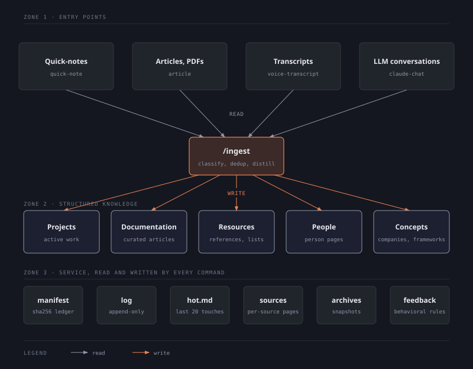

<p align="center">
  
</p>

<h1 align="center">obsidian-wiki</h1>

<p align="center">
  <a href="https://github.com/giovi321/obsidian-wiki/actions/workflows/validate.yml"></a>
  <a href="https://github.com/giovi321/obsidian-wiki/actions/workflows/docs.yml"></a>
  <a href="LICENSE"></a>
</p>

<p align="center">
  <a href="https://giovi321.github.io/obsidian-wiki/"></a>
</p>

A plugin for [Claude Code](https://docs.claude.com/en/docs/claude-code) that turns folders in your Obsidian vault into a wiki an agent maintains for you.

You already save things you mean to come back to: quick notes, PDFs, saved articles, voice memos, exported chats. Most of it you never open again. obsidian-wiki fixes the second half of that habit. Drop a source into an entry-point folder, run one command, and the agent reads it and writes it up as short, cross-linked wiki pages: what the source said, distilled, with a link back to the original and a note on how much to trust it. You read and edit the result in Obsidian, exactly like any other note.

Nothing about it is magic and nothing runs on its own. It is a set of commands you invoke, a few folders in your vault, and a plain-markdown output you own. If you deleted the plugin tomorrow, every page it wrote would still be there and still readable.

<p align="center">
  
</p>

The full documentation lives at **[giovi321.github.io/obsidian-wiki](https://giovi321.github.io/obsidian-wiki/)**. This README is the short version.

## Table of contents

- [Why a wiki, not a RAG](#why-a-wiki-not-a-rag)
- [What it does](#what-it-does)
- [What it is not](#what-it-is-not)
- [Quick start](#quick-start)
- [Commands](#commands)
- [Logging](#logging)
- [Documentation](#documentation)
- [License](#license)

## Why a wiki, not a RAG

A wiki is the rare knowledge format that serves a language model and a human equally well. The same markdown file is the model's context and your reference page: a named title, a summary, cross-links, typed relationships, and a marker on each claim saying where it came from and how confident it is. A model reads that structure natively and can navigate it by links. So can you.

That is the opposite of a typical RAG store, where your documents are chopped into embedding chunks you cannot read, retrieval returns fragments by fuzzy similarity, and there is nothing to open, correct, or trust. With a wiki you can structure any kind of knowledge for a model, notes, transcripts, papers, conversations, while keeping it fully human-readable and editable. Retrieval walks an index and follows links you can see, rather than ranking opaque vectors. The store keeps its value with the model switched off.

The full argument, including where RAG is still the right tool, is in [Why a wiki, not a RAG](https://giovi321.github.io/obsidian-wiki/concepts/why-a-wiki-not-a-rag/).

## What it does

Three things, in this order.

1. Ingests: scans folders you nominate as entry points, hashes new and changed files, classifies them by source type, extracts the durable knowledge, and writes it into your knowledge folders. Each claim carries a provenance marker (extracted, inferred, ambiguous). Each page carries a confidence score computed from the count and quality of its sources.
2. Maintains: cross-links pages, surfaces orphans and broken links, flags stale and low-confidence content, tracks each page from `draft` to `reviewed` to `verified`, and proposes archiving projects that have gone quiet.
3. Answers and updates: answers questions using only the wiki, folds in targeted updates from a URL or free text, captures the durable parts of the current conversation, and runs web research that gets distilled back into pages.

## What it is not

- Not a chat-history dump. Conversation sources score 0.3 by default and are filtered hard before any content reaches a page; verbatim assistant output is never written
- Not autonomous. Every command is invoked by you. There is no background indexing, no watcher, no scheduled task
- Not a replacement for Obsidian. Output is plain markdown with wikilinks and frontmatter on disk; you keep using Obsidian to read, search, and navigate the graph

## Quick start

Five steps, about five minutes if you already use Obsidian.

1. Install the plugin. In Claude Code CLI: `/plugin marketplace add giovi321/obsidian-wiki` then `/plugin install obsidian-wiki`. In Cowork: Customize, Personal plugins, Browse plugins, paste `giovi321/obsidian-wiki`, install
2. Install the required Obsidian community plugins: Dataview, Tasks, Periodic Notes, Front Matter Timestamps, Folder Notes
3. Register your wiki: run `/setup-wiki`. The interview asks for the wiki name, root folder, which entry points to enable, which knowledge folders to enable, and a few thresholds. Pick a short slug of one to four characters
4. Drop a source into one of the entry points, then run `/ingest <slug>`. The agent distills it into pages and files the source away
5. Ask the wiki something: `/query <slug> "what did I save about X?"`

Full walkthrough: [Install in Claude Code](https://giovi321.github.io/obsidian-wiki/getting-started/claude-code/) and [First run](https://giovi321.github.io/obsidian-wiki/getting-started/first-run/).

## Commands

The plugin ships one canonical file per verb. Every command takes the wiki slug as its first argument; if only one wiki is registered, the slug is optional.

| Command | Does |
|---|---|
| `/help` | Print the command reference and registered wikis |
| `/setup-wiki` | Register a new wiki or reconfigure an existing one |
| `/ingest` | Ingest sources from entry points and curate changed pages |
| `/ingest-url` | Alias for `/ingest <URL>` |
| `/ingest-claude` | Ingest the current LLM session or saved conversation exports |
| `/capture` | Save durable knowledge from the current conversation. Add `--quick` to stage findings to `_raw/` in under 60 seconds without touching the manifest |
| `/query` | Answer using only the wiki contents; path questions traverse typed relationships |
| `/narrate` | Render a cited readout of a topic from the wiki in a briefing, plain-language, or lecturer voice; `--save` writes to `_readouts/` |
| `/update` | Targeted update of one page with new info |
| `/research` | Search the web for a topic and distill 3 to 5 sources into pages |
| `/synthesize` | Find concepts that co-occur across pages but lack a synthesis page and write cross-cutting synthesis pages |
| `/lint` | Audit for orphans, broken links, stale pages, contradictions |
| `/cross-linker` | Audit and repair wikilinks across the wiki |
| `/taxonomy` | Audit or normalize the tag vocabulary against `wiki-config.md` `tags:` |
| `/project` | List, create, archive, reactivate, or update project status |
| `/status` | Health summary plus an ingest recommendation |
| `/insights` | Analyze the wiki's link graph (hubs, bridges, cohesion) into `_service/insights.md` |
| `/archive` | Snapshot structured knowledge into `_archives/` |
| `/rebuild` | Archive, then reprocess every source from scratch |
| `/restore` | Restore from a previous archive |
| `/feedback` | Record a behavioral rule in `_service/feedback.md` |
| `/daily-note` | Create today's daily journal note from template |
| `/update-docs` | Refresh the shared docs folder from the plugin's current README and diagrams |
| `/upgrade` | Refresh plugin-managed files (CLAUDE.md per wiki plus shared docs) after a plugin update |

Full argument, zone, and side-effect reference: [Commands](https://giovi321.github.io/obsidian-wiki/using/commands/).

## Logging

Every command appends one structured line to the wiki's `_service/log.md`, inside a fenced code block so Obsidian does not italicize the underscores:

```
- [ISO-8601] OPERATION key=value key="string value" ...
```

Operations: `INGEST`, `CAPTURE`, `LINT`, `ARCHIVE`, `REBUILD`, `RESTORE`, `PROJECT`, `QUERY`, `STATUS`, `CROSS-LINK`, `RESEARCH`, `UPDATE`, `INGEST-CLAUDE`, `FEEDBACK`, `PROMOTE`, `UPGRADE`, `TAXONOMY`, `NARRATE`, `SYNTHESIZE`, `INSIGHTS`. URL sources log as `INGEST` with `source_type=url`.

## Documentation

The full manual is published at [giovi321.github.io/obsidian-wiki](https://giovi321.github.io/obsidian-wiki/): getting started, the concepts (why a wiki beats a RAG, entry points, the page lifecycle, provenance and confidence), the architecture with diagrams, the daily workflow, the command reference, and every schema.

The docs site is built with [Astro Starlight](https://starlight.astro.build/) from the sources under [`docs/`](docs/) and deployed to GitHub Pages by [`.github/workflows/docs.yml`](.github/workflows/docs.yml) on every push to `main`. The plugin also copies this README and the diagrams under [`docs/diagrams/`](docs/diagrams/) into each vault's `_service/docs/` folder via `/update-docs`, so an offline copy always ships with your wiki.

## License

MIT. See [LICENSE](LICENSE).
