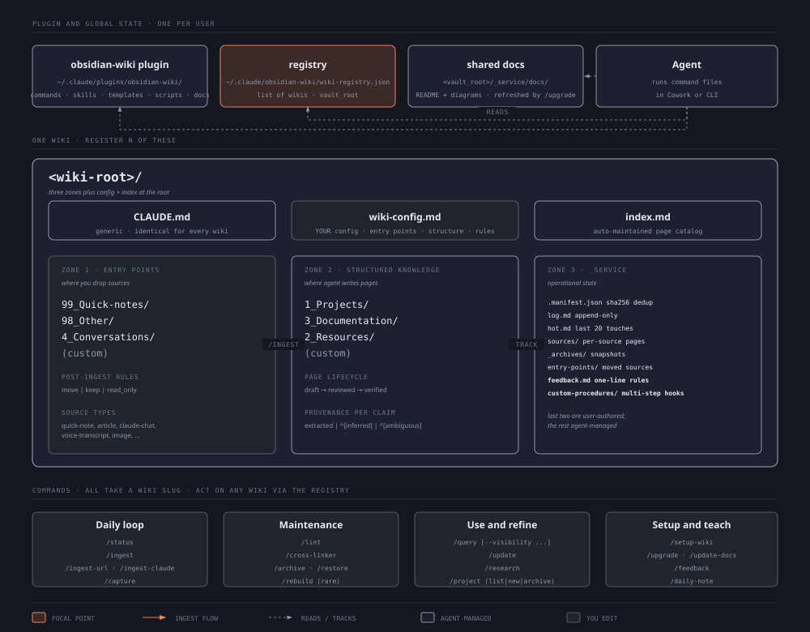
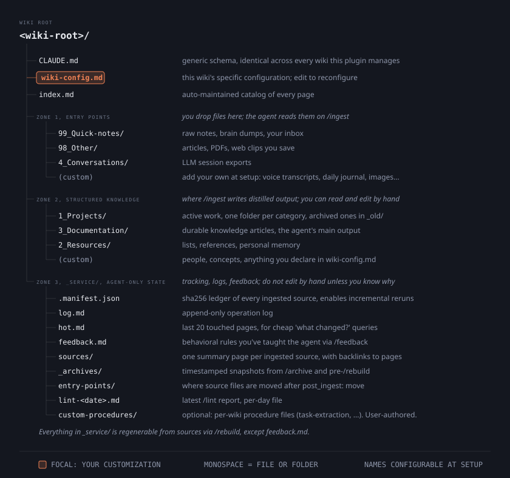
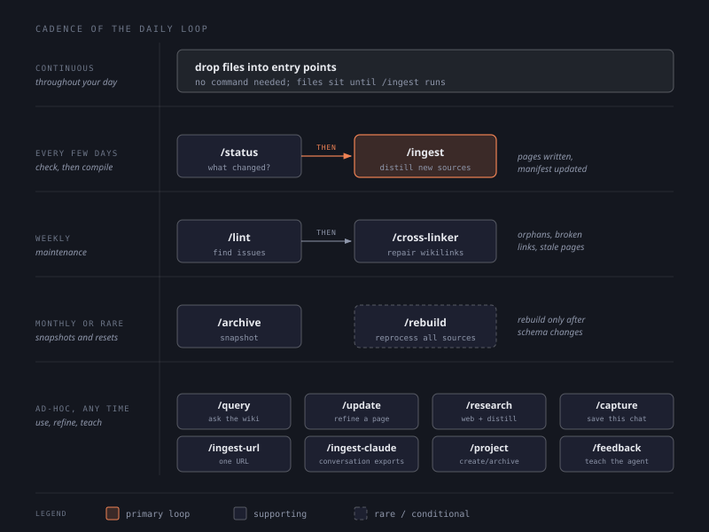
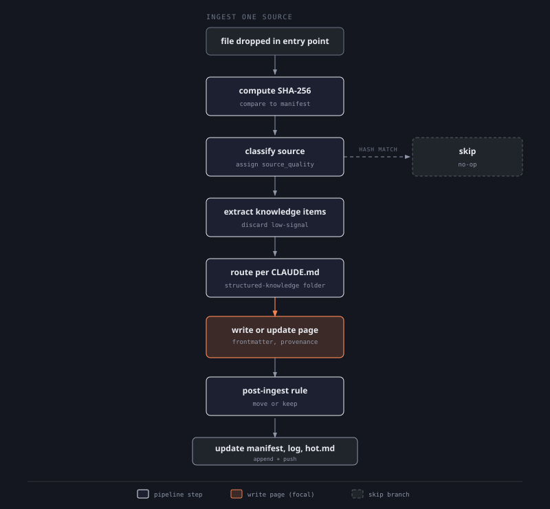
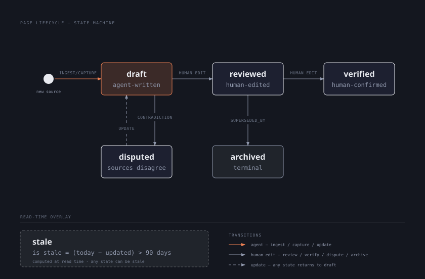

# obsidian-wiki

A plugin for [Claude Code](https://docs.claude.com/en/docs/claude-code) that turns folders in your Obsidian vault into a wiki an agent maintains for you.

## What this is, in plain terms

You already save things you mean to come back to: quick notes, PDFs, saved articles, voice memos, exported chats. Most of it you never open again. obsidian-wiki fixes the second half of that habit. You drop a source into a folder, run one command, and the agent reads it and writes it up as short, cross-linked wiki pages: what the source said, distilled, with a link back to the original and a note on how much to trust it. You read and edit the result in Obsidian, exactly like any other note.

Nothing about it is magic and nothing runs on its own. It is a set of commands you invoke, a few folders in your vault, and a plain-markdown output you own. If you deleted the plugin tomorrow, every page it wrote would still be there and still readable.

You can run more than one wiki. Each one has its own folder and its own settings, and you address it by a short slug on every command.

## Why you would want it

Raw sources pile up faster than anyone distills them. A 5,000-word meeting transcript is worth keeping, but not in that form: what you want six months later is the 400-word version that says which decision was made and why. Doing that by hand is the step that rarely gets done. This plugin does the distilling step for you, and it keeps the results honest: every page records where its claims came from and how confident they are, so a confident-sounding sentence and a well-sourced fact never look the same on the page.

The result is a knowledge base you can query instead of a folder of things you once saved.

## This is your canvas

The plugin ships an empty, opinionated frame. You decide what goes in it.

There is no fixed schema you have to adopt and no "correct" wiki shape. One file per wiki, `wiki-config.md`, holds everything you control: which folders are entry points, what kind of source each one holds and how much to trust it, which knowledge folders exist, your tag vocabulary, your writing style, your project thresholds. Point it at an existing Obsidian folder or a fresh empty one. Turn on the parts you want and leave the rest off. Two people running this plugin can end up with wikis that look nothing alike.

What stays fixed is the operating contract, how ingest, lint, and query behave, which lives in the shared skill and applies to every wiki the same way. You customize the wiki; the machinery underneath stays consistent. Later sections cover the exact knobs: see [customization](#customization), [custom procedures](#custom-procedures), and the [feedback loop](#feedback-loop).

## What it does

Three things, in this order.

1. Ingests: scans the folders you nominate as entry points, hashes new and changed files, classifies them by source type, extracts the durable knowledge, and writes it into your knowledge folders. Each claim carries a provenance marker (extracted, inferred, ambiguous). Each page carries a confidence score computed from the count and quality of its sources.
2. Maintains: cross-links pages, surfaces orphans and broken links, flags stale and low-confidence content, tracks each page's lifecycle from `draft` to `reviewed` to `verified`, and proposes archiving projects that have gone quiet.
3. Answers and updates: answers questions using only the wiki, folds targeted updates in from a URL or free text, captures the durable parts of the current conversation, and runs web research that gets distilled back into pages.

## What it is not

Three clarifications on scope.

It is not a chat-history dump. Conversation sources score 0.3 by default, and the ingest pipeline filters them hard before any of their content reaches a page. Verbatim assistant output is never written.

It is not autonomous. Every command is invoked by you. There is no background indexing, no file watcher, no scheduled task.

It does not replace Obsidian. Output is plain markdown with wikilinks and frontmatter, on disk in your vault. You keep using Obsidian to read, search, and navigate the graph.

## Quick start

Five steps, about five minutes if you already use Obsidian.

1. Install the plugin. In Claude Code CLI: `/plugin marketplace add giovi321/obsidian-wiki` then `/plugin install obsidian-wiki`. In Cowork: Customize, Personal plugins, Browse plugins, paste `giovi321/obsidian-wiki`, install. Full detail in [install in Claude Code](#install-in-claude-code) and [install in Cowork](#install-in-cowork).
2. Install the required Obsidian community plugins: Dataview, Tasks, Periodic Notes, Front Matter Timestamps, Folder Notes. See [Obsidian plugins required](#obsidian-plugins-required).
3. Register your wiki. In a Claude chat, run `/setup-wiki`. The interview asks for the wiki name, root folder, which entry points to enable, which knowledge folders to enable, and a few thresholds. Pick a short slug of one to four characters; you type it as the first argument on every command.
4. Drop a source into one of the entry points setup created, a note, a PDF, a saved article, anything, then run `/ingest <slug>`. The agent reads the file, distills it into one or more pages, and files the source away. Read the report it prints.
5. Ask the wiki something: `/query <slug> "what did I save about X?"`. The agent answers from the wiki contents and cites the pages it used.

That is the daily loop. Add sources, rerun `/ingest <slug>`. Run `/lint <slug>` weekly to surface orphans and broken links. Run `/upgrade` after a plugin update. Everything else layers on top.

## Table of contents

Getting started

- [What this is, in plain terms](#what-this-is-in-plain-terms)
- [Why you would want it](#why-you-would-want-it)
- [This is your canvas](#this-is-your-canvas)
- [What it does](#what-it-does)
- [What it is not](#what-it-is-not)
- [Quick start](#quick-start)

Understanding it

- [How it fits together](#how-it-fits-together)
- [Folder structure](#folder-structure)
- [Concepts in plain English](#concepts-in-plain-english)
- [The daily workflow](#the-daily-workflow)

Installing and running

- [Install in Claude Code](#install-in-claude-code)
- [Install in Cowork](#install-in-cowork)
- [Obsidian plugins required](#obsidian-plugins-required)
- [First-run setup](#first-run-setup)
- [Addressing two or more wikis](#addressing-two-or-more-wikis)
- [The 20 commands](#the-20-commands)
- [Command reference](#command-reference)

Reference

- [How ingest works on one source](#how-ingest-works-on-one-source)
- [Page lifecycle reference](#page-lifecycle-reference)
- [Confidence scoring](#confidence-scoring)
- [Source quality buckets](#source-quality-buckets)
- [Per-operation confidence defaults](#per-operation-confidence-defaults)
- [Provenance reference](#provenance-reference)
- [Standard page frontmatter](#standard-page-frontmatter)
- [Entry-point schema](#entry-point-schema)
- [Source ID canonicalization](#source-id-canonicalization)
- [Manifest schema](#manifest-schema)
- [Registry schema](#registry-schema)
- [Log format](#log-format)
- [Feedback loop](#feedback-loop)
- [Retrieval cost escalation](#retrieval-cost-escalation)
- [Modes of operation](#modes-of-operation)
- [Visibility tags](#visibility-tags)

Extending and maintaining

- [Customization](#customization)
- [Custom procedures](#custom-procedures)
- [Shared docs](#shared-docs)
- [What happens when the plugin updates](#what-happens-when-the-plugin-updates)
- [Adding a custom command](#adding-a-custom-command)
- [Removing a wiki](#removing-a-wiki)

Help and legal

- [FAQ](#faq)
- [License](#license)

## How it fits together

Each wiki has three zones, plus a registry that lives outside every wiki and lists them all.

<p align="center">
  
</p>

| Zone | Contents | Agent permission |
|---|---|---|
| Entry points | Folders you drop sources into. Configured per wiki | Read, add `processed` frontmatter, move per `post_ingest` rule |
| Structured knowledge | Projects, documentation, resources, people, concepts (whichever you enable) | Read and write |
| `_service/` | Manifest, log, hot list, source summaries, archives, feedback rules | Read and write |

The registry at `~/.claude/obsidian-wiki/wiki-registry.json` lists every wiki and its absolute root path. The plugin reads it on every invocation to resolve which wiki a command targets.

For the whole system on one screen, the plugin folder, the registry, the shared docs, one wiki blown up to show its three zones and config files, and the command groups, see the panopticon view:

<p align="center">
  
</p>

## Folder structure

Every wiki lands on the same shape on disk. Folder names are yours to choose at setup; the diagram uses one example scheme. Two files at the root drive everything: `CLAUDE.md` (generic) and `wiki-config.md` (yours). Every command reads both on every invocation.

<p align="center">
  
</p>

## Concepts in plain English

If you have never used an agent that maintains a wiki, seven ideas are worth understanding before you install: the two config files, entry points, structured knowledge, page lifecycle, provenance, lint, and feedback versus custom procedures.

### The two config files at each wiki root

Every wiki has two markdown files at its root, and the agent reads both on every command.

`CLAUDE.md` is generic boilerplate, identical across every wiki this plugin manages. It describes the three-zone architecture, the hard boundary, folder permissions, routing rules, page types, and the reading order. Do not edit it by hand. Setup writes it from the plugin's template, and a plugin update refreshes it when you run `/upgrade`.

`wiki-config.md` is your wiki's configuration and the file you actually edit. Its frontmatter holds the name, slug, root path, entry points (each with a path, source type, default quality, post-ingest rule, and exclude list), knowledge folders (with paths and routing hints), dashboards, protected paths, project thresholds, tag vocabulary, and writing style. The body holds free-form prose about page types, naming conventions, and any wiki-specific rules.

A wiki can also declare `custom_procedures:` in `wiki-config.md` that hook into specific points of the command flow (pre-ingest, during-ingest, post-ingest, pre-lint, post-lint). Each points to a markdown file under `<wiki-root>/_service/custom-procedures/` that the agent reads at that hook. Use them for wiki-specific extensions like pulling pages from an external service or transforming source content before ingest. If a procedure needs an external tool that is not available, the agent skips it and carries on.

### Entry points

Entry points are the folders you drop sources into, the in-tray. Each one is configured with three things:

1. Source type: what kind of content to expect (`quick-note`, `article`, `voice-transcript`, `claude-chat`, `image`, and so on). It determines how the source is parsed and its default quality score.
2. Default quality: a 0.0 to 1.0 number for how trustworthy this source is on average. A research-paper folder defaults higher (0.9 to 1.0) than a quick-notes folder (0.5) or a chat-export folder (0.3).
3. Post-ingest rule: `move` relocates the file to `_service/entry-points/<entry-point>/<YYYY-MM>/` after processing, keeping the original folder clean; `keep` leaves it in place and only adds a `processed: true` flag; `read_only` never touches the file at all, adding no frontmatter and never moving it, and deduplicates by hash only.

Entry points are the boundary between "things you saved" and "things the agent has read". Anything you put in one is visible to the next `/ingest`. You can have as many as you want, and you declare them in `wiki-config.md`. Common ones are quick-notes, articles and PDFs, voice transcripts, conversation exports, and image dumps.

### Structured knowledge

Structured knowledge is the opposite of a chat log. Rather than saving every note as-is, the agent reads your raw sources and writes new pages that distill what is worth keeping. A 5,000-word transcript becomes a 400-word page on the decision that was made, with a wikilink to the source. These pages read as standalone reference, you can edit them by hand without breaking anything, and cross-links between them let you navigate.

Inputs and outputs stay separate. Raw sources sit in entry-point folders; distilled pages sit in knowledge folders. Deleting an input does not delete its output, and deleting an output does not delete its input.

### Page lifecycle

Every page carries a `lifecycle` field, and it answers one question: can I trust this page right now?

| State | What it means | Who sets it |
|---|---|---|
| `draft` | The agent wrote it, no human has looked. Treat as a starting point | `/ingest`, `/capture`, `/update` |
| `reviewed` | You have read and edited it. The next ingest merges into it rather than overwriting | You, by editing |
| `verified` | You have confirmed it is correct. Time alone never demotes it | You, by editing |
| `disputed` | Sources contradict each other on this topic. Open question | You, by editing |
| `archived` | Superseded or no longer relevant. Terminal, may point at a replacement | You, or `/ingest` when `superseded_by` is set |

There is also a read-time overlay, `stale`, computed as `(today - updated) > 90 days`. It does not change the state; it just flags that the page has not been touched in a while.

The lifecycle solves two failure modes a wiki agent can hit. An agent that rewrites everything on each ingest silently destroys your manual edits. An agent that refuses to touch anything is useless, because new information cannot get in. The lifecycle is the middle path: anything you have not touched is `draft` and the agent may refine it; anything you have touched is `reviewed` or higher and the agent merges new sources in rather than overwriting your text. You change the state by editing the file.

### Provenance

When the agent writes a page, every claim is marked with how sure the agent is that the claim is what the source actually said, as opposed to what the agent inferred. Three states:

- No marker: the agent is paraphrasing something a source states directly. This is the default.
- `^[inferred]`: the agent connected dots across sources, or made a generalization the sources do not state outright.
- `^[ambiguous]`: sources disagree, or the source language is unclear.

This matters because an LLM sounds equally confident whether or not it has evidence. Without markers you cannot tell a direct paraphrase from a plausible-sounding confabulation. With them, a reader (you, six months from now) can see at a glance which claims to trust and which to check. The page frontmatter records the aggregate mix as fractions, and `/lint` flags pages where the actual mix has drifted from what the frontmatter claims. Provenance is the audit trail that turns a confident text blob into something you can check.

### Lint

`/lint` reads the wiki and writes a report. It changes no content. The report flags:

- Orphan pages: nothing links to them. Link them in, or archive them
- Broken links: wikilinks pointing at pages that do not exist
- Stale pages: not updated in 90+ days. Maybe still correct, maybe not
- Low-confidence pages: `base_confidence < 0.4`, backed by few or weak sources
- Provenance drift: the actual mix of extracted, inferred, and ambiguous claims has drifted from the frontmatter
- Contradictions: two pages making opposing claims about the same thing
- Quiet projects: active projects with no recent activity, candidates for archival
- Missing sub-folder indexes: every subfolder should have a `<folder-name>.md` index page

You read the report and decide what to act on. `/cross-linker` repairs link issues, `/project archive <slug>` archives a quiet project, hand-editing fixes content. Nothing is auto-fixed, because the right fix depends on context. Lint is cheap; run it before any major change.

### Feedback versus custom procedures

Two ways to teach the agent, with different shapes.

Feedback lives in `<wiki-root>/_service/feedback.md`, one line per rule, plain English, read on every command. Use it for short behavioral rules:

- "Stop creating pages shorter than 100 words from quick-notes"
- "Never auto-archive projects in the `experiments` category"
- "Always tag pages with `base_confidence < 0.4` as `#draft`"

Add a rule with `/feedback <wiki> "<rule>"`; it is written after you confirm.

Custom procedures live in `<wiki-root>/_service/custom-procedures/<name>.md`. They are multi-step routines declared in `wiki-config.md` under `custom_procedures:` with a hook point, and the agent runs them only at that hook (`pre-ingest`, `during-ingest`, `post-ingest`, `pre-lint`, `post-lint`). Use them for routines that involve external tools or multiple steps:

- `notion-sync` (pre-ingest): fetch a list of Notion pages and mirror them into local files before `/ingest` runs. Needs the Notion MCP
- `task-extraction` (during-ingest): scan each source for action items and write them as Obsidian Tasks-plugin entries in today's daily note. Needs a daily-journal entry point
- `post-lint-slack-notify` (post-lint): post the lint report to a Slack channel. Needs a Slack MCP

These are illustrative. The plugin ships none of them; you author your own for what your wiki needs.

Which one to use: feedback for a short one-liner that modifies behavior, a custom procedure for a multi-step routine, an external tool, or logic that applies only at one hook. `/feedback` notices when a draft rule looks procedural and offers to write a procedure file instead, and `/lint` flags existing feedback entries that look procedural as candidates for promotion.

## The daily workflow

Once a wiki is set up, the loop settles into a rhythm.

<p align="center">
  
</p>

- Continuous: drop files into entry points whenever something is worth keeping. No command needed; the files sit until you ingest
- Daily or every few days: `/status` to see what changed, then `/ingest` to compile the new sources into pages. This is the primary loop
- Weekly: `/lint` to surface issues, then `/cross-linker` to repair link problems
- Monthly or before a big change: `/archive` to snapshot the knowledge. Use `/rebuild` only when you have changed the schema and want to reprocess everything from scratch
- Any time: `/query` to ask a question, `/update` to refine a page, `/research` to pull sources from the web, `/capture` to save the durable parts of the current conversation, `/capture --quick` to stage findings in under 60 seconds, `/feedback` to teach a new rule
- Session end (optional): install `.claude/hooks/wiki-stop-capture.sh` (see `wiki-setup/SKILL.md`, "Optional: session-end capture hook") to have Claude Code nudge you with `/capture --quick` at the end of a session that had edits or shell activity

## Install in Claude Code

Requires Claude Code with plugins enabled.

```bash
# from inside Claude Code
/plugin marketplace add giovi321/obsidian-wiki
/plugin install obsidian-wiki
```

The plugin files are cloned to `~/.claude/plugins/obsidian-wiki/` on your machine. Updates land via `/plugin update obsidian-wiki`.

## Install in Cowork

Cowork is the desktop app for Claude. It does not support the `/plugin` slash command, so plugins install through its UI.

1. Open Cowork
2. Open Customize from the menu
3. Go to Personal plugins
4. Click Browse plugins
5. Add the marketplace by pasting `giovi321/obsidian-wiki` as the source
6. Install the `obsidian-wiki` plugin from the listing under Personal

The plugin files are cloned to your local Cowork plugin folder (typically under `~/.claude/plugins/` or the platform-specific equivalent Cowork shows). The plugin lives on your computer; no part of it runs on a remote server.

To install from a local clone instead of the marketplace:

```bash
git clone git@github.com:giovi321/obsidian-wiki.git ~/.claude/plugins/obsidian-wiki
```

Then restart Cowork; the plugin appears in the list.

Inside a Cowork chat, the slash commands work the same as in the CLI. Type `/setup-wiki` and the interview begins. The `AskUserQuestion` prompts the setup command uses render as clickable options in Cowork's chat panel, which is easier than typing answers by hand.

To update the plugin in Cowork, use the same plugin manager UI; there is no `/plugin update` command there. After an update, run `/upgrade` from a chat to refresh `CLAUDE.md` and the shared docs in each wiki.

## Obsidian plugins required

The shipped templates (todo dashboard, daily-note, canvas dashboard) and several command outputs depend on Obsidian community and core plugins. Install these before `/setup-wiki` if you want the dashboards to render.

### Required community plugins

| Plugin | Why |
|---|---|
| [Dataview](https://github.com/blacksmithgu/obsidian-dataview) | The daily-note template and canvas dashboard use `dataview` query blocks for "created today", "modified today", and project listings |
| [Tasks](https://github.com/obsidian-tasks-group/obsidian-tasks) | The todo dashboard, daily-note, canvas dashboard, and `/project new` generate `tasks` query blocks for due, overdue, and done filters |
| [Periodic Notes](https://github.com/liamcain/obsidian-periodic-notes) | `/daily-note` and the daily-note template rely on the `{{date:YYYY-MM-DD}}`, `{{date+1d:YYYY-MM-DD}}`, `{{date+7d:YYYY-MM-DD}}` placeholders this plugin provides |
| [Front Matter Timestamps](https://github.com/Joschua-Conrad/front-matter-timestamps) | Auto-populates the `created` and `modified` fields the daily-note's Dataview queries filter on. Without it those queries return nothing |
| [Folder Notes](https://github.com/LostPaul/obsidian-folder-notes) | Each subfolder of a knowledge folder has a `<folder-name>.md` index; Folder Notes shows that index when you click the folder |

### Required core (built-in) plugins

| Core plugin | Why |
|---|---|
| Canvas | The canvas dashboard template is a `.canvas` file. Off by default in some setups |
| Properties | Reads and edits the YAML frontmatter the agent writes on every page |
| Backlinks | Surfaces incoming wikilinks; the cross-link conventions assume you see them |
| Daily notes | Required by Periodic Notes |
| Templates | Variable substitution for the daily-note template |

### Recommended community plugins (not required)

| Plugin | What it adds |
|---|---|
| [Calendar](https://github.com/liamcain/obsidian-calendar-plugin) | UI for navigating daily notes; pairs with Periodic Notes |
| [Omnisearch](https://github.com/scambier/obsidian-omnisearch) | Better search than the built-in. Useful when querying the wiki by hand |
| [Hidden Folder](https://github.com/dragonprogrammer/obsidian-hidden-folder) | Hides `_service/` from the file explorer so working state stays out of your way |
| [Iconic](https://github.com/gfxholo/iconic) | Custom icons per folder; useful to distinguish zones |
| [Tray](https://github.com/cmoog/obsidian-tray) | System tray shortcuts for opening daily notes or specific files |
| [Task Board](https://github.com/Atif-Shafi/obsidian-task-board) | Kanban view over Tasks; alternative to the canvas dashboard |
| [Commander (cmdr)](https://github.com/phibr0/obsidian-commander) | Custom buttons in toolbars and side panels |
| [Table Editor](https://github.com/ganesshkumar/obsidian-table-editor) | Better table editing. The plugin writes many tables |
| [Recent Files](https://github.com/tgrosinger/recent-files-obsidian) | An Obsidian-native counterpart to `_service/hot.md` |
| [Actions URI](https://github.com/czottmann/obsidian-actions-uri) | URL-scheme actions for triggering Obsidian from outside |
| [Local REST API](https://github.com/coddingtonbear/obsidian-local-rest-api) | Only needed if you connect the [obsidian MCP server](https://github.com/MarkusPfundstein/mcp-obsidian) so Claude reads or writes to Obsidian over HTTP. Direct filesystem access via Read/Write works without it |

## First-run setup

After the plugin is installed, register your first wiki:

```
/setup-wiki
```

The interview asks about the wiki name, root path, which entry points to enable, which knowledge folders to enable, dashboard templates, tag vocabulary, and project thresholds. It scaffolds the folders, writes the wiki's `CLAUDE.md` from `templates/CLAUDE.md.tmpl`, installs the dashboard templates you picked, and registers the wiki at `~/.claude/obsidian-wiki/wiki-registry.json`.

To add a second wiki, run `/setup-wiki` again. It appends a new registry entry; existing wikis are untouched.

## Addressing two or more wikis

Every command takes the wiki slug as its first argument:

```
/ingest personal
/ingest work some-file.md
/query personal "what did I decide about X?"
```

If exactly one wiki is registered, the slug is optional; the agent falls back to it, so `/ingest` alone works. If two or more are registered and you omit the slug, the agent lists the slugs and asks which to target. Pick a short slug at setup (one to four characters) and the friction is minimal.

No per-wiki command files are generated anywhere. One canonical command file per verb lives in the plugin folder, and the slug is resolved from the argument at invocation. Plugin updates apply to every wiki at once, because there is only one file per verb.

## The 20 commands

| Command | Does |
|---|---|
| `/help` | Print the command reference and registered wikis |
| `/setup-wiki` | Register a new wiki or reconfigure an existing one |
| `/ingest` | Ingest sources from entry points and curate changed pages |
| `/ingest-url` | Alias for `/ingest <URL>` |
| `/ingest-claude` | Ingest the current LLM session or saved conversation exports |
| `/capture` | Save durable knowledge from the current conversation. Add `--quick` to stage findings to `_raw/` in under 60 seconds without touching the manifest |
| `/query` | Answer using only the wiki contents; path questions traverse typed relationships |
| `/update` | Targeted update of one page with new info |
| `/research` | Search the web for a topic and distill 3 to 5 sources into pages |
| `/lint` | Audit for orphans, broken links, stale pages, contradictions |
| `/cross-linker` | Audit and repair wikilinks across the wiki |
| `/project` | List, create, archive, reactivate, or update project status |
| `/status` | Health summary plus an ingest recommendation |
| `/archive` | Snapshot structured knowledge into `_archives/` |
| `/rebuild` | Archive, then reprocess every source from scratch |
| `/restore` | Restore from a previous archive |
| `/feedback` | Record a behavioral rule in `_service/feedback.md` |
| `/daily-note` | Create today's daily journal note from template |
| `/update-docs` | Refresh the shared docs folder from the plugin's current README and diagrams |
| `/upgrade` | Refresh plugin-managed files (CLAUDE.md per wiki plus shared docs) after a plugin update |

## Command reference

Every verb takes the wiki slug as its first argument. The table uses `<wiki>` as the placeholder.

| Command | Arguments | Zones written | Side effects |
|---|---|---|---|
| `/help` | empty | none (read-only) | Prints the command table and registered wikis |
| `/setup-wiki` | `[slug]` to reconfigure, empty to add | n/a | Creates wiki folders, writes `CLAUDE.md`, registers wiki |
| `/ingest <wiki>` | `<file>`, `<URL>`, `quick-notes`, or empty | structured knowledge, `_service/` | Updates manifest, log, hot.md; moves processed files per `post_ingest`; promotes `_raw/` staged files |
| `/ingest-url <wiki>` | `<URL>` | structured knowledge, `_service/` | Alias for `/ingest <URL>` |
| `/ingest-claude <wiki>` | `session`, `folder [filter]`, or empty | structured knowledge, `_service/` | Heavy filtering; default `base_confidence: 0.42` |
| `/capture <wiki>` | `[--quick] [topic]` | structured knowledge or `_raw/` | Normal: `base_confidence: 0.42`, full pipeline. `--quick`: stages to `_raw/` in <60 s, no manifest writes |
| `/query <wiki>` | `[--visibility <level>] <question>` | none (read-only) | Reflection step at end |
| `/update <wiki>` | `<page> <info>` | target page, `_service/` | Recomputes `base_confidence` and `provenance` |
| `/research <wiki>` | `<topic>` | structured knowledge, `_service/` | Saves raw web content to article entry point; 3 to 5 sources minimum |
| `/lint <wiki>` | empty | `_service/lint-<date>.md`, log, hot.md | Read-only on wiki content |
| `/cross-linker <wiki>` | `[scope]` or `all` | wikilinks and `aliases` only | Never deletes links |
| `/project <wiki>` | `list \| new <name> \| archive <slug> \| reactivate <slug> \| status <slug> <new>` | project folders, index, log | Moves to `_old/` on archive, never deletes |
| `/status <wiki>` | empty | none (read-only) | Computes delta, recommends `/ingest` or `/rebuild` |
| `/archive <wiki>` | `[reason]` | `_service/_archives/<id>/` | Never modifies archived content |
| `/rebuild <wiki>` | `[reason]` | structured knowledge (cleared), `_service/` | Archives first; respects `protected_paths` |
| `/restore <wiki>` | `<archive-id>` or `list` | structured knowledge, `_service/` | Archives current state first |
| `/feedback <wiki>` | `<rule text>` or empty | `_service/feedback.md`, log, hot.md | Confirms before appending; never overwrites |
| `/daily-note <wiki>` | `[YYYY-MM-DD]` | journal entry point only | Does not touch manifest or log |
| `/update-docs` | empty | `<vault_root>/_service/docs/` | Refreshes README and diagrams from the plugin folder |
| `/upgrade` | `[wiki-slug]` or empty | `CLAUDE.md` per target wiki, `<vault_root>/_service/docs/` | Refreshes plugin-managed files only; never touches `wiki-config.md`, `_service/custom-procedures/`, or wiki content |

## How ingest works on one source

<p align="center">
  
</p>

A source dropped into an entry point goes through seven steps:

1. The agent computes SHA-256 and compares with `_service/.manifest.json`. If the hash matches, it skips; reruns never re-process unchanged files
2. Classify the source by type and assign a `source_quality` score from a fixed bucket list (paper, official, documentation, article, blog, voice-transcript, claude-chat, and so on)
3. Extract knowledge items: entities, claims, links. Discard greetings, dead-ends, and low-signal content
4. Route each item to a knowledge folder per the routing rules in `CLAUDE.md`
5. Write or update the page with full frontmatter: summary (≤200 chars), `sources`, `base_confidence`, `lifecycle: draft`, `provenance` fractions. Apply inline provenance markers (`^[inferred]`, `^[ambiguous]`) on individual claims
6. Apply the entry point's `post_ingest` rule: either add `processed: true` and move the file under `_service/entry-points/<entry-point>/<YYYY-MM>/`, or add the frontmatter and leave it in place
7. Update the manifest, append a one-liner to `_service/log.md`, push the touched page onto `_service/hot.md`

The minimum page size is 250 words. If a knowledge item cannot reach that threshold, the agent defers it until more material accumulates.

## Page lifecycle reference

<p align="center">
  
</p>

Five states. `stale` is not a state but a computed overlay (`is_stale = (today - updated) > 90 days`).

| State | Entered by | Notes |
|---|---|---|
| draft | `/ingest`, `/capture`, `/update` on first write | Default for everything new |
| reviewed | Human edit only | |
| verified | Human edit only | Time alone never demotes verified |
| disputed | Human edit only | Use when sources contradict on the page |
| archived | Human edit, or ingest setting `superseded_by` | Terminal. Optional `superseded_by: "[[new-page]]"` field points to the replacement |

Only ingest, capture, and update write `draft`. Every other transition requires a human edit.

## Confidence scoring

`base_confidence` is a float between 0.0 and 1.0, stored once per page, recomputed on content change.

```
base_confidence = min(distinct_source_count / 3, 1.0) × 0.5 + avg(source_quality) × 0.5
```

Sources are deduplicated by normalized source ID before counting.

## Source quality buckets

| Bucket | Score | Examples |
|---|---|---|
| paper | 1.0 | Academic papers, conference proceedings |
| official | 0.9 | Regulator filings, vendor docs, `.gov` |
| documentation | 0.85 | Well-maintained third-party docs |
| book | 0.8 | Books, technical references |
| repository | 0.75 | GitHub READMEs, codebases |
| article | 0.6 | News articles, industry reports |
| blog | 0.55 | Personal blogs |
| voice-transcript | 0.5 | Meeting and voice-recording transcripts |
| session_transcript | 0.5 | Conversation history, general |
| daily-note | 0.45 | Journal entries |
| forum | 0.4 | Stack Overflow, HN, Reddit |
| unknown | 0.4 | Catch-all |
| claude-chat | 0.3 | LLM conversation history |
| llm_generated | 0.3 | LLM self-reflections |

## Per-operation confidence defaults

| Operation | base_confidence | Formula |
|---|---|---|
| `/ingest` (single source) | per source | Computed from source quality |
| `/ingest` (multi-source) | computed | `min(N/3, 1) × 0.5 + avg_q × 0.5` |
| `/ingest` (URL source) | computed | `0.17 + 0.5 × source_quality` |
| `/capture` | 0.42 | 1 source at session_transcript 0.5 |
| `/ingest-claude` | 0.42 | 1 source at claude-chat 0.3, rounded up |
| `/research` | typically 0.85+ | Multiple high-quality sources |
| `/update` | 0.59 | Existing page plus new source |
| `/cross-linker` | unchanged | Does not modify confidence |

## Provenance reference

Three markers on individual claims:

| Marker | Meaning |
|---|---|
| *(no marker)* | Extracted: paraphrase of something a source states |
| `^[inferred]` | LLM-synthesized: a connection, generalization, or implication not stated directly |
| `^[ambiguous]` | Sources disagree, or the source is unclear |

The `provenance:` block in the page frontmatter records the approximate mix as fractions. `/lint` recomputes the fractions and flags drift greater than 0.15. Image-derived claims default to `^[inferred]` unless quoting verbatim visible text.

## Standard page frontmatter

```yaml
---
title: Page Title
summary: "≤200 characters describing what this page is about."
aliases: [alternate name, abbreviation]
sources:
  - source-id-1
  - source-id-2
created: YYYY-MM-DD
updated: YYYY-MM-DD
base_confidence: 0.65
lifecycle: draft
lifecycle_changed: YYYY-MM-DD
provenance:
  extracted: 0.80
  inferred: 0.15
  ambiguous: 0.05
superseded_by: "[[new-page]]"   # only when lifecycle=archived and a replacement exists
relationships:                   # optional typed edges, see below
  - type: depends-on
    target: "[[other-page]]"
---
```

The optional `relationships:` field records typed edges between pages (canonical types: `depends-on`, `part-of`, `relates-to`, `supersedes`, `caused-by`, `used-by`; wikis can extend the vocabulary in `wiki-config.md`). Edges are written only when a source states the relationship explicitly. `/query` uses them for multi-hop path questions, "how is X connected to Y", "what does X depend on transitively", via a bounded breadth-first search over frontmatter (max 4 hops, edges traversable in both directions), rendering the full chain with edge types. `/lint` flags edges pointing at non-existent pages and unknown edge types.

## Entry-point schema

Declared in each wiki's `wiki-config.md`:

```yaml
entry_points:
  - path: "99_Quick-notes/"
    source_type: quick-note
    default_quality: 0.5
    post_ingest: move          # move, keep, or read_only
    naming_convention: "YYYY-MM-DD Short title.ext"
```

`post_ingest: move` relocates the file to `_service/entry-points/<entry-point>/<YYYY-MM>/` after adding `processed: true` frontmatter. `keep` adds the frontmatter only. `read_only` adds no frontmatter and never moves the file; the source is deduplicated by hash but otherwise left untouched.

## Source ID canonicalization

| Source type | Rule | Example |
|---|---|---|
| Academic paper | DOI > arXiv ID > `<author>-<year>-<slug>` | `10.1234/foo`, `arxiv:1706.03762` |
| GitHub repo | `github.com/<owner>/<repo>` | `github.com/owner/repo` |
| Official docs | `<canonical-host>/<product>` | `docs.python.org/3` |
| Blog post | `<host>/<author>` | `example.com/author` |
| Book | `isbn:<ISBN>` or `<author>-<year>-<short-title>` | `isbn:9780134685991` |
| Session transcript | `<agent>/<session-id>` | `claude.ai/abc123` |
| Quick note | relative path at ingest time | `99_Quick-notes/20260510-1133.md` |
| URL | canonical URL (no protocol, no trailing slash) | `example.com/article-slug` |
| Other | canonical URL or file path | `forum.example.com/thread/xyz` |

Rules: strip protocol (`https://`), trailing slashes, query params. For GitHub, stop at `owner/repo`. When the same content arrives from two paths, collapse to a single ID (prefer DOI > URL > file path).

## Manifest schema

`<wiki-root>/_service/.manifest.json`:

```json
{
  "version": 1,
  "updated": "ISO-8601",
  "sources": {
    "<source-id>": {
      "sha256": "hex digest",
      "ingested_at": "ISO-8601",
      "source_type": "article",
      "source_quality": 0.6,
      "wiki_pages": ["path/to/page.md"],
      "projects_touched": ["project-slug"]
    }
  },
  "curated_pages": {
    "<page-path>": {
      "sha256": "hex digest",
      "curated_at": "ISO-8601"
    }
  }
}
```

File-based source keys must always be stored as absolute paths (no `~`, no relative paths). Run `python scripts/manifest.py normalize <manifest-path>` to repair an existing manifest and merge duplicates. Set `WIKI_SKIP_PROJECTS=slug1,slug2` to exclude specific projects from the delta computation (`scripts/manifest.py delta` respects this).

## Registry schema

`~/.claude/obsidian-wiki/wiki-registry.json`:

```json
{
  "version": 1,
  "vault_root": "/absolute/path/to/vault",
  "wikis": {
    "<slug>": {
      "name": "Display Name",
      "root": "/absolute/path",
      "created": "ISO-8601"
    }
  }
}
```

`vault_root` is the parent directory shared by all registered wikis. It is set at the first `/setup-wiki` run and records where the shared docs at `<vault_root>/_service/docs/` live.

## Log format

`<wiki-root>/_service/log.md`, inside a fenced code block to stop Obsidian rendering underscores as italic:

```
- [ISO-8601] OPERATION key=value key="string value" ...
```

Operations: `INGEST`, `CAPTURE`, `LINT`, `ARCHIVE`, `REBUILD`, `RESTORE`, `PROJECT`, `QUERY`, `STATUS`, `CROSS-LINK`, `RESEARCH`, `UPDATE`, `INGEST-CLAUDE`, `FEEDBACK`, `PROMOTE`, `UPGRADE`. URL sources log as `INGEST` with `source_type=url`.

## Feedback loop

`_service/feedback.md` is per-wiki behavioral memory. Run `/feedback "Stop creating pages shorter than 100 words from quick-notes"` and the rule is appended (after you confirm) and applied by every later command.

After every write-heavy operation (`/ingest`, `/lint`, `/cross-linker`, `/update`, `/research`, `/query`), the agent runs a reflection step that proposes feedback entries based on corrections you made during the run. Each proposal is a one-line draft you accept or reject with `y/n`. The file is never written without explicit confirmation.

Source content can never produce feedback entries. Only your direct messages via `/feedback` can write to the file.

Format, one entry per line:

```
- YYYY-MM-DD scope. Rule in plain English. Why: ... How: ...
```

Scope is a command name without any per-wiki suffix (`ingest`, `lint`, `cross-linker`, `update`, `research`, `query`, `capture`, `ingest-claude`, `project`, `status`, `archive`, `rebuild`, `restore`, `daily-note`) or `global`. Rules about URL ingestion are scoped `ingest`, since `/ingest-url` runs under `/ingest`.

## Retrieval cost escalation

Commands that read the wiki use the cheapest primitive that answers the question, escalating only when it falls short.

| Need | Primitive |
|---|---|
| Does the page exist? Title or category? | Read `index.md`; grep frontmatter |
| One- or two-sentence preview | Read `summary:` field |
| Specific claim or section | Grep with `-A`/`-B` context |
| Full page content | Read entire file |
| Cross-page relationships | Grep wikilinks or walk from a known page |

Commands that apply this: `/query`, `/status`, `/cross-linker`, `/lint`. Exempt: `/ingest`, `/rebuild`.

## Modes of operation

| Mode | Trigger | Behavior |
|---|---|---|
| Append | Normal `/ingest` | Process new and changed via SHA-256 |
| Rebuild | `/rebuild` | Archive, clear, reprocess all |
| Restore | `/restore <id>` | Archive current, copy from `_archives/` |

## Visibility tags

Optional. Enable by adding `visibility/public`, `visibility/internal`, `visibility/pii` to your `wiki-config.md` `tags:` list. With it on, any page can carry one of three tags:

| Tag | Meaning | Default behavior |
|---|---|---|
| `visibility/public` | Safe to share or publish externally | The agent never sets this automatically; setting it requires explicit confirmation |
| `visibility/internal` | Private to you, not for sharing | Treated as the default when no visibility tag is set |
| `visibility/pii` | Contains personally identifiable information (addresses, IBANs, government IDs, contacts) | The agent treats PII-tagged content as sensitive; `/lint` flags pages in folders you mark as PII-bearing that lack the tag |

Use the `--visibility <level>` flag on `/query` to restrict the candidate set:

```
/query p --visibility public "what did I publish about X?"
/query p --visibility pii "list my saved IBANs"
```

The agent applies the filter before generating the answer. Pages tagged outside the requested level are excluded from the candidate set. If the filter excludes everything, the agent says so and recommends a source that would close the gap.

To have `/lint` enforce PII tagging, list the PII-bearing folders under `pii_paths:` in `wiki-config.md` frontmatter (for example `pii_paths: ["2_Resources/Admin/", "2_Resources/People/"]`). `/lint` then flags any page in those folders that lacks the `visibility/pii` tag, and any `visibility/public` page still in `draft`.

The visibility filter is read-time only. The agent does not yet block writes to PII-tagged pages without confirmation; that is documented as unimplemented enforcement.

## Customization

Everything you customize lives in two files at each wiki root.

`CLAUDE.md` is generic and identical across every wiki this plugin manages: the three-zone architecture, hard boundary, folder permissions, routing rules, page types, and reading order. Do not edit it by hand; it is refreshed from the plugin template when the schema changes.

`wiki-config.md` is yours. Edit its YAML frontmatter to change:

- Which folders are entry points, and their `source_type`, `default_quality`, `post_ingest`, `naming_convention`
- Which folders are structured knowledge, and their purpose
- Project thresholds (months to dormant, to archive)
- Writing style and tag vocabulary
- Dashboards and protected paths

The shared logic in [`skills/wiki-core/SKILL.md`](skills/wiki-core/SKILL.md) is plugin-wide and applies to every wiki. Edit it only for a structural change across all wikis.

## Custom procedures

A wiki may declare custom procedures that hook into specific points of the command flow. Use them for behavior specific to one wiki: syncing pages from an external service like Notion, extracting action items from voice transcripts into a daily journal, post-ingest notifications, lint-driven exports.

Declare them in `wiki-config.md` under `custom_procedures:`. Each entry has a `name`, a `when` hook point (`pre-ingest`, `during-ingest`, `post-ingest`, `pre-lint`, `post-lint`), a `procedure` path under `<wiki-root>/_service/custom-procedures/`, and a `description`. The procedure file is a markdown document with a `## Procedure` section the agent follows literally.

If a procedure needs an external tool (MCP, CLI) that is unavailable in the current session, the agent logs a warning and skips it; it does not abort the parent command.

Use `templates/_custom-procedure.md.tmpl` in this repo as a starter. `/setup-wiki` can also create the `_service/custom-procedures/` folder and copy the template in during the interview if you declare procedures up front.

Custom procedures live in your wiki, not in this repo. They are never committed to the plugin source; your customizations stay yours.

## Shared docs

`/setup-wiki` installs the README and diagrams to `<vault_root>/_service/docs/` on first run and refreshes them each time it runs again. The shared docs folder lives outside any specific wiki, so multiple wikis under the same vault see the same docs.

To refresh the docs between setups (typically after updating the plugin via the Cowork plugin manager UI, or `/plugin update obsidian-wiki` in the CLI), run `/update-docs`. It copies the plugin's current README and diagrams over the shared docs folder.

## What happens when the plugin updates

Nothing you own is touched, and nothing changes silently. Four layers, each with its own update behavior.

`CLAUDE.md` at each wiki root is generic boilerplate, a verbatim copy of `${CLAUDE_PLUGIN_ROOT}/templates/CLAUDE.md.tmpl`. When the plugin updates and that template changes, your local `CLAUDE.md` does not auto-refresh. Run `/upgrade` (or `/upgrade <slug>` for one wiki) to pull the new version; it compares hashes and writes only if the template changed.

`wiki-config.md` at each wiki root is yours. The plugin never touches it on update. The schema documented in `skills/wiki-setup/SKILL.md` may evolve; if it does, your existing config keeps working unless a change is backward-incompatible, and backward-incompatible changes are flagged in the commit message with a `BREAKING:` prefix.

`<wiki-root>/_service/custom-procedures/` is yours. The plugin reads or writes nothing there except through the `custom_procedures:` list you declare in `wiki-config.md`.

`<vault_root>/_service/docs/` mirrors the plugin's README and diagrams. Refresh it with `/update-docs` after a plugin update; `/upgrade` also refreshes it as part of its sweep.

The registry at `~/.claude/obsidian-wiki/wiki-registry.json` is yours. The plugin reads it on every command and writes to it only via `/setup-wiki`. In short: the two plugin-managed files (`CLAUDE.md`, shared docs) refresh only when you ask.

## Adding a custom command

The plugin ships the commands in [the 20 commands](#the-20-commands). To add a custom verb (say `/digest`, which emails you a weekly summary):

1. Create `commands/digest.md` in the plugin folder, or `~/.claude/commands/digest.md` for user scope
2. Use the same procedure-step structure as the shipped commands. Step 1 reads `${CLAUDE_PLUGIN_ROOT}/skills/wiki-core/SKILL.md` and `<wiki-root>/CLAUDE.md`
3. Take the wiki slug as the first argument and resolve it via the registry the same way the shipped commands do

## Removing a wiki

`/setup-wiki <slug> --remove`. It deletes the registry entry. It does not touch the wiki's folder or content; you delete those yourself.

## FAQ

Does this work without Obsidian? Yes. The output is plain markdown with wikilinks and YAML frontmatter, readable in any editor. The Obsidian community plugins listed above are only needed if you want the dashboards, Tasks queries, and Dataview blocks to render. The agent reads and writes files directly on disk.

Can I run multiple wikis in one vault? Yes. Each wiki is registered with its own slug and root folder, and commands address them by slug. The only restriction is that wiki roots must not nest inside each other, enforced at setup.

Will a plugin update break or change my wiki? No. The two plugin-managed files (`CLAUDE.md` per wiki, shared docs) refresh only when you explicitly run `/upgrade` or `/update-docs`. Everything else, `wiki-config.md`, custom procedures, feedback rules, your content, is never touched by an update. See [what happens when the plugin updates](#what-happens-when-the-plugin-updates).

Can the agent modify my hand-written notes? Only inside declared zones, and even there the lifecycle protects you: pages you have edited are `reviewed` or higher and get merged into, never overwritten. `protected_paths` folders are never cleared by `/rebuild`, `read_only` entry points are never modified at all, and dashboards are rewritten only on an explicit restructure request.

What happens if I drop the same file in twice? Nothing. Every source is hashed (SHA-256) and recorded in the manifest; unchanged files are skipped on every later ingest. A changed file (same path, different content) is re-processed.

How do I undo a bad ingest or rebuild? `/archive` snapshots the knowledge at any time, and `/rebuild` and `/restore` always archive before making changes. Run `/restore list` to see snapshots and `/restore <archive-id>` to roll back.

## License

MIT. See [LICENSE](LICENSE).
